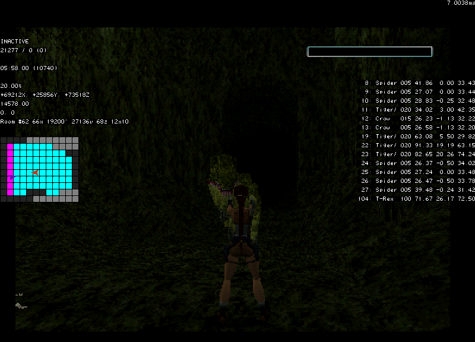
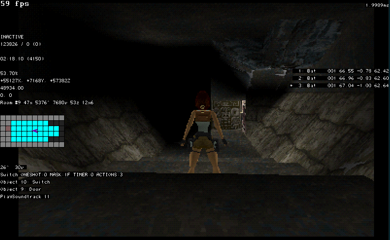
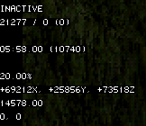
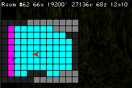
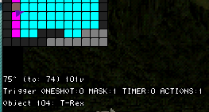
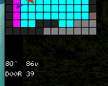
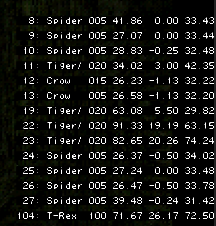

# classic-utils
A utility script for classic Tomb Raider games when running in emulator, written in Lua. Requires Bizhawk.

This script aims to provide a lot of information to the player while playing, without being too obtrusive to the experience; this is not for casual players, however, and should not be used in speedruns except for route finding or glitch hunting (since this would be considered cheating).

## Game support 
* Tomb Raider II (PAL) fully supported.
* Tomb Raider I (USA) (v1.6) experimental support.

## Features
* Movie info (for tool-asssited speedruns).
* Display Lara's current information: position, speed, angles, etc.
* Room info - where is it, how tall is it?
* All active enemy information, including health and positions.
* Display a full mini-map of the current room. 
* Interrogate all triggers in the current room and see what happens.

## Planned
* Support for TR1 and TR3. 
* Pathfinding, both for the enemies and the player (route optimization), displayed on the map.
* Various cheats/config options - wireframe, flight mode, finish level, etc.

## Detail

### Left Panel

1. INACTIVE 
    * This is the status of the current movie. INACTIVE means there is no movie; there is also RECORDING or PLAYING. Only useful for Tool-Assisted speedruns.
2. 21277 / 0 (0)
    * More movie info. This is the current frame of the movie (or emulator frame if inactive), followed by the maximum frames (length of the current movie) and rerecords.
3. 05:58:00 (10740)
    * As you can probably guess, this is a timer - specifically, the timer of the current level, how long Lara has spent there. The number in brackets is the total number of game ticks. This isn't useful except for optimization.
4. 20.00% 
    * This is Lara's current health, as a percentage.
5. +69212X, [...]
    * This is Lara's X position (in pixels), Y position, and Z position respectively.
6. 14578.00 
    * This is Lara's current yaw (rotation). The maximum value is 65536.
7. 0, 0
    * Not very useful for display purposes here, but this is Lara's movement speed along XZ followed by Lara's vertical (jump) speed.

#### Room info and minimap

* The next line is the current room info condensed onto one line. 
    * Room #62 - the current room number.
    * 66x - the X position of the room.
    * 19200^ - the Y position of the top of the room.
    * 27136v - the Y position of the bottom of the room.
    * 68z - the Z position of the room.
    * 12x10 - the width and height of the room. (Width first.)

##### Minimap
* The small image of tiles you see is a "minimap" of the current room Lara is standing in.
    * Light blue tiles are regular (floor) tiles.
    * Black tiles are door, or portal, tiles. They lead to another room.
    * Pink tiles are trigger tiles. They cause something to happen when Lara is standing on them, or some other event occurs.
    * Grey tiles are walls. Lara and enemies can not pass through these.
* You can interrogate the tiles in some cases.
    * For pink tiles (triggers), hover over it to see trigger details. Here we can see that the trigger activates a T-Rex:

         
    * For black tiles (portals), hover over it to see portal details. Here we can see that portal leads to room 39:

         
* Furthermore, the minimap will show all enemy positions (red arrowhead) and Lara's position in the room (purple arrowhead) in real time.

### Right Panel
 

* Here, we display all enemy details for every active entity that has been triggered and is not currently dead.
* The information string details (in order): item ID (in level), Short Name, Health, X Pos., Y Pos., Z Pos..

## Contributing
Please feel free to use the code however you wish. If you use something here in your own work, credit would be appreciated but not required. Contributions or ideas are very welcome.